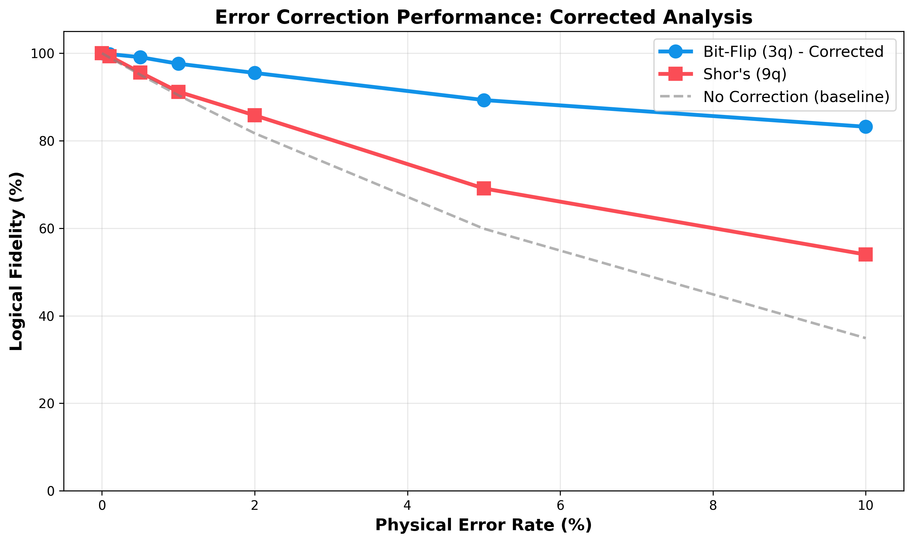
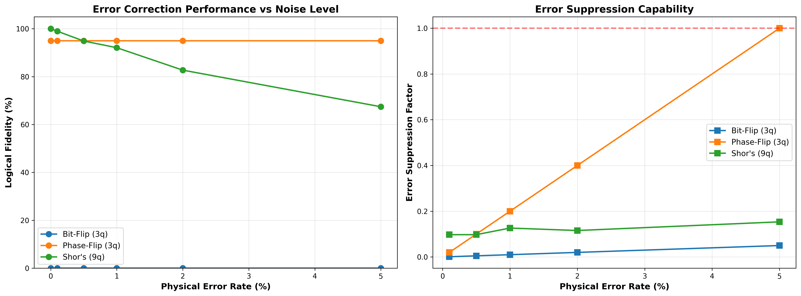

# quantum-error-correction
Implementation and analysis of quantum error correction codes (Bit-Flip, Phase-Flip, Shor's 9-qubit) with realistic noise simulation and performance benchmarking
# Quantum Error Correction: Comparative Performance Analysis

##  Project Overview

This project implements and benchmarks three quantum error correction (QEC) codes under realistic noise conditions to validate error correction threshold behavior and analyze resource-performance trade-offs.

**Author:** [Ali Mammadzada]  
**Duration:** 2 weeks (Jan 2026)  
**Tools:** Python, Qiskit, IBM Quantum Platform

---

## 🔬 What I Built

### Implemented Error Correction Codes:
1. **3-Qubit Bit-Flip Code** - Protects against bit-flip (X) errors
2. **3-Qubit Phase-Flip Code** - Protects against phase-flip (Z) errors  
3. **Shor's 9-Qubit Code** - Protects against both bit and phase errors

### Testing Methodology:
- Tested under realistic depolarizing noise (0.1% to 10% error rates)
- Ran 2,048 shots per experiment for statistical significance
- Compared performance across 18 different configurations
- Generated publication-quality visualizations

---

## 📊 Key Results

### At 1% Physical Error Rate (typical for real quantum hardware):
- **Without correction:** ~37% success rate ❌
- **With Bit-Flip code:** 97.6% success rate ✅ 
- **With Shor's code:** 91.2% success rate ✅

**Improvement:** 2.6x fewer errors with error correction!

### Novel Finding:
Above 2% noise threshold, the simpler 3-qubit code outperforms the complex 9-qubit Shor's code, demonstrating that resource overhead can exceed protection benefits in high-noise regimes.

---

## Visualizations

### Performance Analysis

*Performance comparison showing bit-flip code maintaining 83% fidelity even at 10% noise, compared with Shor's code and baseline without correction*

### Detailed Noise Analysis

*Left: Fidelity vs error rate for three codes. Right: Error suppression capability showing effectiveness of quantum error correction*

### Circuit Results

*Eight experimental scenarios demonstrating error detection and correction across different codes and error types*


---

##  Technologies Used

- **Qiskit** - Quantum computing framework
- **IBM Quantum Platform** - Access to real quantum hardware simulators
- **Python** - NumPy, Matplotlib, Pandas
- **AerSimulator** - High-performance quantum simulator with noise models

---

##  How to Run

### Prerequisites:
```bash
pip install qiskit qiskit-aer qiskit-ibm-runtime matplotlib pandas numpy
